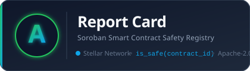

# <p align="center">📋 Report Card</p>

<p align="center">
  
</p>

<p align="center">
  <strong>A safety registry for Soroban smart contracts — so wallets can warn users before they sign.</strong>
</p>

[](LICENSE)
[](LICENSE)
[](https://stellar.org)
[]()

Before your wallet signs, it asks one question:

```
is_safe(contract_id) → { grade: "A", upgradeable: false, attestation_count: 2, … }
```

Audit attestations + WASM static analysis + reproducible-build source verification — fused into a single **A–F grade** that any wallet, contract, or dApp can read in one call.

---

## Why it exists

Soroban is young. Users routinely sign transactions against contracts they cannot read. Contracts can be silently upgradeable, hold admin backdoors, or be entirely unaudited — and there is nowhere shared to answer *"is this safe to interact with?"*

Report Card is that shared place. It is infrastructure, not an app.

---

## The 10-second demo

| Scenario | Grade | What you see |
|---|---|---|
| Paste a secretly-upgradeable contract | **D** | 🔴 "Admin can replace this code at any time." |
| Paste a fully-audited, source-verified contract | **A** | ✅ Auditor name · WASM hash · confidence 95% |

---

## Architecture

Three strictly-decoupled layers. Each can be replaced independently.

```
┌──────────────────────────────────────────────────────────────────┐
│  LAYER 3 — Dashboard  (Next.js 14 · Tailwind · app router)       │
│                                                                  │
│  /                   Homepage — search bar + recent contracts    │
│  /contract/[id]      Full report: grade · evidence · attest.     │
│  /auditor            Wallet-connected attestation portal         │
│  /api/safety?id=     CORS-open JSON endpoint for wallets         │
└──────────────────────────┬───────────────────────────────────────┘
                           │  fetchSafetyRecord()  /  /api/safety
┌──────────────────────────▼───────────────────────────────────────┐
│  LAYER 2 — Engine  (Node.js 20 · TypeScript · ESM)               │
│                                                                  │
│  ingest.ts    Pull WASM via Soroban RPC getLedgerEntries          │
│  scoring.ts   5-signal weighted rubric → A–F grade               │
│  verify.ts    Reproducible Docker build → hash comparison        │
│  relayer.ts   Sign & submit set_flags() on-chain                 │
│  index.ts     Scheduler (cron) + CLI entry-point                 │
└──────────────────────────┬───────────────────────────────────────┘
                           │  set_flags()  ·  submit_attestation()
┌──────────────────────────▼───────────────────────────────────────┐
│  LAYER 1 — Contract  (Rust · Soroban SDK 21 · WASM)              │
│                                                                  │
│  initialize()          Bootstrap admin + relayer                 │
│  is_safe()  ← READ     Returns SafetyRecord (grade + evidence)   │
│  register_auditor()    Admin onboards auditor with reputation    │
│  deactivate_auditor()  Admin slashes / removes auditor           │
│  submit_attestation()  Auditor signs verdict bound to WASM hash  │
│  set_flags()           Relayer writes WASM analysis flags        │
│  event: graded         Emitted on every grade change             │
└──────────────────────────────────────────────────────────────────┘
```

---

## Scoring rubric

Every grade is deterministic and fully explainable from public on-chain data.

| Signal | Weight | What it measures |
|---|:---:|---|
| Signed audit attestations | **30%** | Recognised auditors sign the exact WASM hash; weighted by reputation |
| Source verification | **25%** | Reproducible build of the claimed repo matches the on-chain WASM hash |
| Upgradeability exposure | **20%** | Admin-controlled code-swap path detected in WASM bytecode |
| Admin-power surface | **15%** | Unbounded mint / freeze / drain gated by a single key |
| Maturity & usage | **10%** | Contract age · distinct users · native XLM TVL proxy |

**Grade thresholds:** A ≥ 80 · B ≥ 65 · C ≥ 50 · D ≥ 35 · F < 35

---

## Repository structure

```
report_card/
│
├── packages/
│   └── types/                  ← @reportcard/types  (shared source of truth)
│       └── src/index.ts           GradeLetter, SafetyRecord, WalletKit,
│                                  NetworkConfig, SIGNAL_WEIGHTS, helpers
│
├── contracts/
│   └── report_card/            ← @reportcard/contract  (Soroban / Rust)
│       ├── src/
│       │   ├── lib.rs             Registry contract (all 6 functions)
│       │   └── test.rs            14 unit + integration tests
│       └── Cargo.toml
│
├── engine/                     ← @reportcard/engine  (Node.js / TypeScript)
│   ├── src/
│   │   ├── index.ts               Scheduler + CLI entry-point
│   │   ├── ingest.ts              Soroban RPC WASM pull + Horizon metadata
│   │   ├── scoring.ts             5-signal weighted rubric
│   │   ├── verify.ts              Reproducible-build source verification
│   │   └── relayer.ts             On-chain verdict submission
│   ├── .env.example
│   └── package.json
│
├── web/                        ← @reportcard/web  (Next.js 14)
│   ├── app/
│   │   ├── page.tsx               Homepage (search + stats + recent)
│   │   ├── contract/[id]/         Full safety report
│   │   ├── auditor/               Wallet-connected attestation portal
│   │   └── api/safety/            REST endpoint for wallets
│   ├── components/
│   │   ├── GradeCard.tsx          Big letter + flag pills + upgrade warning
│   │   ├── EvidenceChecklist.tsx  Pass/fail per signal with weights
│   │   ├── AttestationList.tsx    On-chain auditor attestations
│   │   ├── SearchBar.tsx          Contract ID lookup
│   │   ├── HeroStats.tsx          Registry aggregate stats
│   │   ├── RecentContracts.tsx    Grade grid from seed data
│   │   └── WalletButton.tsx       Freighter connect/disconnect
│   ├── lib/
│   │   ├── registry.ts            Soroban RPC view calls + write tx
│   │   ├── useWallet.ts           Wallet kit React hook (typed WalletKit)
│   │   ├── gradeUtils.ts          Tailwind colour helpers per grade
│   │   ├── seedContracts.ts       Demo contracts for homepage
│   │   ├── seedAttestations.ts    Demo attestations for AttestationList
│   │   └── knownAuditors.ts       Demo auditor identities
│   ├── .env.local.example
│   └── package.json
│
├── sdk/                        ← @reportcard/sdk  (isomorphic client)
│   ├── index.ts                   ReportCard class · isSafe() · http+rpc
│   ├── package.json
│   └── tsconfig.json
│
├── data/                       ← CC-BY-4.0 open dataset
│   ├── contracts.json             Contracts processed by the engine
│   └── README.md
│
├── scripts/
│   └── deploy.sh                  5-step Testnet build + deploy + init
│
├── package.json                ← npm workspaces root
├── .gitignore
├── LICENSE                     ← Apache-2.0 (code) / CC-BY-4.0 (data)
└── README.md
```

---

## Quick start

### Prerequisites

```bash
# Rust + WASM target
rustup target add wasm32-unknown-unknown

# Stellar CLI
cargo install --locked stellar-cli

# Node.js 20+  (check: node --version)
# npm 10+      (check: npm --version)
```

### 1 — Fund a Testnet identity

```bash
stellar keys generate me --network testnet
stellar keys fund me --network testnet
```

### 2 — Deploy the registry contract

```bash
bash scripts/deploy.sh
# Prints:  CONTRACT_ID = C…
```

### 3 — Configure environment

```bash
# Dashboard
cp web/.env.local.example web/.env.local
# Fill in: NEXT_PUBLIC_REGISTRY_CONTRACT_ID=<CONTRACT_ID>

# Engine
cp engine/.env.example engine/.env
# Fill in: REGISTRY_CONTRACT_ID=<CONTRACT_ID>
#          RELAYER_SECRET=<your S… key>
```

### 4 — Install dependencies

```bash
npm install --legacy-peer-deps    # installs all workspaces at once
```

### 5 — Start the dashboard

```bash
npm run dev:web
# → http://localhost:3000
```

### 6 — Run the engine (optional for demo)

```bash
npm run dev:engine -- --once      # analyse data/contracts.json once and exit
npm run dev:engine                # start the 5-minute scheduler
```

---

## Smart-contract API reference

All functions are on the deployed registry contract.

### Read (pure, no fees)

#### `is_safe(contract_id: Address) → SafetyRecord`

Returns the full safety record for any Soroban contract.  
Returns a default **F** record for contracts that have never been analysed.

```json
{
  "grade":             { "letter": "A", "score": 87, "numeric": 5 },
  "upgradeable":       false,
  "source_verified":   true,
  "wasm_hash":         "aa…aa",
  "attestation_count": 2,
  "admin_power":       false,
  "maturity_score":    8
}
```

#### `get_auditor(auditor: Address) → Option<Auditor>`

Returns the auditor record (reputation, meta_hash, active status) or `None`.

#### `get_attestation(contract_id, auditor) → Option<Attestation>`

Returns a specific auditor's attestation for a contract, or `None`.

---

### Write (gated)

| Function | Auth | Purpose |
|---|---|---|
| `initialize(admin, relayer)` | admin (once) | Bootstrap the registry |
| `register_auditor(auditor, reputation, meta_hash)` | admin | Onboard an auditor (rep 1–100) |
| `deactivate_auditor(auditor)` | admin | Slash / disable an auditor |
| `submit_attestation(auditor, contract_id, wasm_hash, verdict, confidence, sig)` | auditor (`require_auth`) | Signed verdict bound to WASM hash |
| `set_flags(contract_id, wasm_hash, upgradeable, source_verified, admin_power, maturity_score)` | relayer | Write objective WASM analysis flags |

---

## SDK — one-line integration

Install:

```bash
npm install @reportcard/sdk
```

### TypeScript / JavaScript (HTTP transport — zero extra deps)

```ts
import { ReportCard } from '@reportcard/sdk';

const rc = new ReportCard({
  transport: 'http',
  apiUrl: 'https://your-dashboard.example.com',
});

const g = await rc.isSafe(contractId);

if (g.gradeNumeric <= 2 || g.upgradeable) {
  showWarning(`Grade ${g.grade}: ${g.explanation}`);
}
```

### TypeScript / JavaScript (RPC transport — direct Soroban)

```ts
import { ReportCard } from '@reportcard/sdk';

const rc = new ReportCard({
  transport: 'rpc',
  network: 'testnet',
  registryContractId: 'C…',
});

const g = await rc.isSafe(contractId);
```

### Soroban cross-contract guard (Rust)

```rust
// Only call contracts that are sufficiently safe.
let g = reportcard::Client::new(&env, &REGISTRY_ID).is_safe(&target_contract);
assert!(g.grade.numeric >= 4, "target contract is below grade B");
```

### HTTP endpoint (wallets, scripts, curl)

```bash
curl "https://your-dashboard.example.com/api/safety?id=CXXXXX…"
```

```json
{
  "contractId": "CXXXXX…",
  "record": {
    "grade": { "letter": "B", "score": 71, "numeric": 4 },
    "upgradeable": false,
    "source_verified": true,
    "attestation_count": 1,
    "admin_power": false,
    "maturity_score": 6
  }
}
```

---

## Engine environment variables

| Variable | Required | Default | Description |
|---|:---:|---|---|
| `STELLAR_NETWORK` | | `testnet` | `testnet` \| `mainnet` \| `futurenet` |
| `REGISTRY_CONTRACT_ID` | ✓ | — | Deployed registry contract ID |
| `RELAYER_SECRET` | ✓ | — | Relayer's Stellar secret key |
| `SOROBAN_RPC_URL` | | SDF testnet | Soroban RPC endpoint |
| `HORIZON_URL` | | SDF testnet | Horizon API endpoint |
| `ENGINE_INTERVAL_MS` | | `300000` | Re-scan interval in ms (5 min) |
| `ENABLE_DOCKER_VERIFY` | | `true` | Use Docker for reproducible builds |
| `LOG_LEVEL` | | `info` | `error` \| `warn` \| `info` \| `debug` |

Copy `engine/.env.example` → `engine/.env` and fill in the required values.

---

## Dashboard environment variables

| Variable | Required | Default | Description |
|---|:---:|---|---|
| `NEXT_PUBLIC_REGISTRY_CONTRACT_ID` | ✓ | — | Deployed registry contract ID |
| `NEXT_PUBLIC_NETWORK` | | `testnet` | `testnet` \| `mainnet` |
| `NEXT_PUBLIC_SOROBAN_RPC_URL` | | SDF testnet | Soroban RPC endpoint |
| `NEXT_PUBLIC_HORIZON_URL` | | SDF testnet | Horizon API endpoint |

Copy `web/.env.local.example` → `web/.env.local` and fill in the required values.

---

## Threat model & anti-abuse

| Attack vector | Mitigation |
|---|---|
| **Fake auditor identities** | Auditors are admin-onboarded with a reputation weight. Low-rep attestations barely move the grade. |
| **Attestation hash swap** | Attestations are cryptographically bound to the exact WASM hash. Redeploying with new code invalidates the old grade. |
| **Time-of-check / time-of-use upgrade** | Upgradeable contracts are permanently surfaced with a red flag and capped in grade, regardless of audit status. |
| **Source-repo mismatch gaming** | A reproducible build must byte-match the on-chain WASM hash or `source_verified` stays `false`. |
| **Rubber-stamp audits** | Multiple independent attestations required to reach grade A. Reputation is slashable via `deactivate_auditor`. |

---

## Decentralisation path

The current design uses a single relayer key for simplicity. The auth model is designed to expand:

1. **Now** — single relayer key set at `initialize()`.
2. **Next** — replace with a multisig account (e.g. 3-of-5 validator set) by updating the relayer address.
3. **Future** — Auditor DAO governing reputation weights and dispute resolution.

---

## Open-source & public-good principles

- **Explainable** — every grade is reproducible from public on-chain data. The dashboard shows the exact evidence behind every signal.
- **Composable-first** — the entire value is in the `is_safe()` call. The SDK and the HTTP endpoint make integration a single line.
- **Not a blacklist** — scores are transparent, contestable, and appealable. Infrastructure, not a surveillance tool.
- **Dual license** — code is Apache-2.0; the seed dataset is CC-BY-4.0. Both are designed to outlive the grant cycle.

---

## Roadmap

- [ ] Auditor DAO governing reputation weights and dispute resolution
- [ ] Formal property checks (no unbounded mint) feeding the grade automatically
- [ ] Wallet-SDK partnerships to make `is_safe()` a default pre-sign check
- [ ] Grade badge widget for dApp frontends
- [ ] Slashing mechanism: on-chain proof that a "safe" verdict was wrong

---

## Contributing

1. Fork the repo and create a branch off `main`.
2. Add your contract to `data/contracts.json` (see `data/README.md`).
3. For the Rust contract: run `cargo test` in `contracts/report_card/` before opening a PR.
4. For TypeScript: run `npm run lint --workspaces --if-present` from the root.
5. Open a PR — the description should state what changed and what was tested.

---

## License

| Scope | License |
|---|---|
| All source code (`contracts/`, `engine/`, `web/`, `sdk/`, `packages/`, `scripts/`) | [Apache-2.0](LICENSE) |
| Open dataset (`data/`) | [CC-BY-4.0](LICENSE) |
